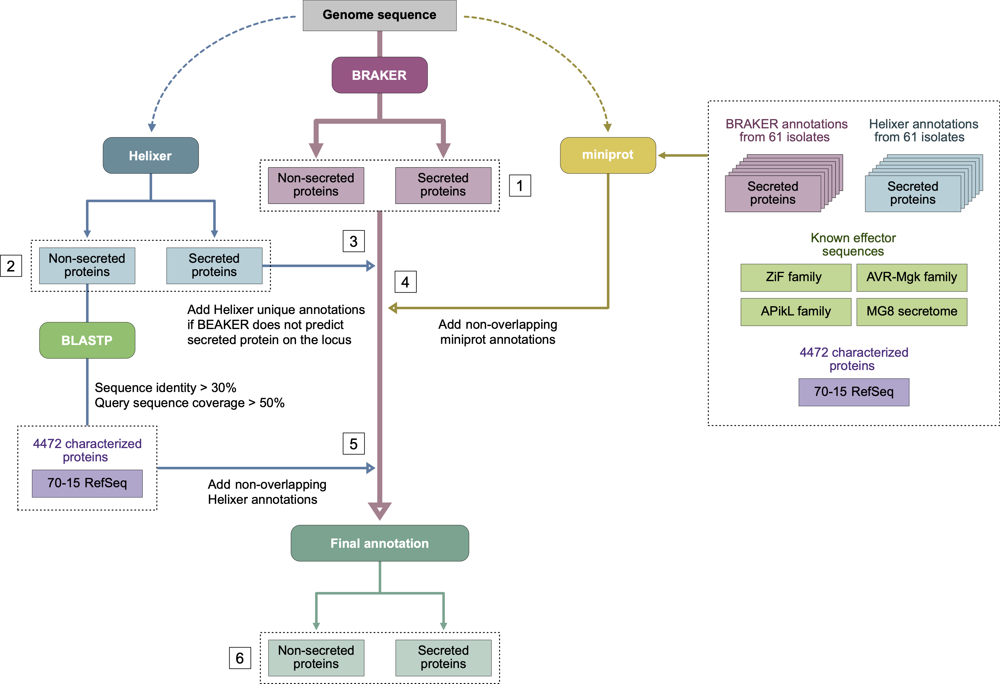

# Rice Blast Pan‑genome Annotation Pipeline

**Figure 1. Overview of the end-to-end annotation pipeline.**

This repository provides a step-by-step annotation workflow and Materials & Methods (MM) for assembling a non-redundant gene set for each *Magnaporthe oryzae* genome. The pipeline integrates BRAKER, Helixer, and protein alignments (miniprot), producing a merged GFF3, CDS, and protein FASTA for each assembly. All commands and input/output layouts are included for reproducibility.

## Table of Contents

- [Running BRAKER](docs/running_braker.md)
- [Running Helixer](docs/running_helixer.md)  
- [Merge annotations and rename IDs](docs/merging_annotations_and_renaming_ids.md)
- [Signal peptide extraction](docs/signal_peptide_extraction.md)
- [Appendix (notes & tips)](docs/appendix.md)

