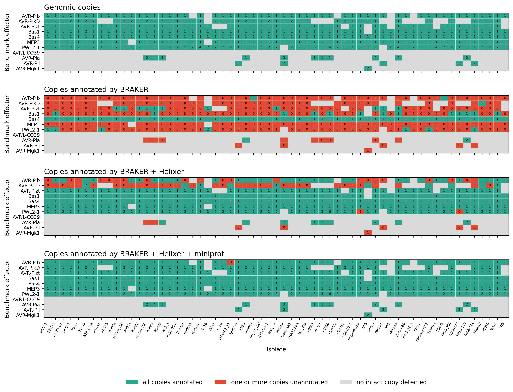

# Effector annotation benchmark

This directory contains the benchmark used to assess how completely the merged gene annotations
describe known effector genes. Each intact genomic copy of a benchmark effector is treated as a
separate target, so that multi-copy families are not reduced to a single call per isolate, and is
scored on whether the annotation contains a full-length gene model of it. The scoring is repeated
for three cumulative annotation sets, BRAKER alone, BRAKER + Helixer, and BRAKER + Helixer +
miniprot, which shows how much each source of evidence adds.



**Figure 1. Helixer and miniprot models annotate effector loci that remain unannotated by BRAKER
alone.** Rows represent the 11 benchmark effectors and columns the 61 *M. oryzae* isolates. The top
panel shows the number of intact genomic copies of each effector detected in each assembly by
tblastn; cells are shown in teal when at least one intact copy was detected. The three lower panels
show the number of these copies annotated by a full-length gene model in each cumulative annotation
set. Cells are shown in teal when all detected copies are annotated and in red when one or more
copies remain unannotated. In all panels, grey indicates that no intact copy was detected in the
corresponding assembly. Counts are shown within cells.

## Contents

- `benchmark.sh`: wrapper that runs the full workflow.
- `data/benchmark_effectors.fa`: effector protein queries used for the benchmark.
- `scripts/01_build_locus_tables.py`: builds the locus-level and isolate-level tables.
- `scripts/02_plot_effector_benchmark.py`: generates the summary figures.
- `figures/`: the PNG and PDF figures produced from the annotations reported in the associated
  publication.

## Required inputs

The workflow expects three input collections with matching isolate names:

1. Genome assemblies: one FASTA file per isolate, named `<isolate>.fa`.
2. Merged gene annotations: one GFF file per isolate, named `<isolate>_merged.gff`.
3. Protein sequences translated from the same merged annotations: one FASTA file per isolate,
   named `<isolate>_protein.fa`.

These correspond to `Frozen_assemblies/` and to the outputs of
[step 12](../docs/12_merge_and_rename_ids.md) (`results/60_merged/`) and
[step 13](../docs/13_export_final_sequences.md) (`results/70_extracted_seq/protein/`) of the
annotation pipeline. No intermediate or temporary annotation files are used as evidence.

The three cumulative annotation sets are reconstructed only from the second column of the merged
GFF files:

- BRAKER alone (source `AUGUSTUS`)
- BRAKER + Helixer (sources `AUGUSTUS`, `Helixer`)
- BRAKER + Helixer + miniprot (sources `AUGUSTUS`, `Helixer`, `miniprot`)

`AUGUSTUS` is the source value that BRAKER writes into the GFF (see
[step 1](../docs/01_braker_prediction.md)).

## Software

| Program / package | Version | Reference |
|-------------------|---------|-----------|
| SeqKit            | 2.10.0  | [SeqKit](https://bioinf.shenwei.me/seqkit/) |
| BLAST+            | 2.16.0+ | [BLAST+](https://blast.ncbi.nlm.nih.gov/) (provides `makeblastdb` and `tblastn`) |
| DIAMOND           | 2.1.13  | [DIAMOND](https://github.com/bbuchfink/diamond) |
| Python            | 3.13.5  | [Python](https://www.python.org/) |
| matplotlib        | 3.10.3  | [matplotlib](https://matplotlib.org/) |

`matplotlib` is the only non-standard Python dependency. Use `--python` if it is available only in
a specific conda or mamba environment.

## Run

From this directory:

```bash
./benchmark.sh \
  --assembly-dir    /path/to/Frozen_assemblies \
  --merged-gff-dir  /path/to/results/60_merged \
  --protein-dir     /path/to/results/70_extracted_seq/protein \
  --outdir          results \
  --threads 4 \
  --jobs 4
```

Peak CPU use is roughly `--jobs` x `--threads`, because each isolate is processed by its own search
job. To use a different query set, pass `--effector-fasta /path/to/effectors.fa`.

## Parameters

The wrapper takes only the options the searches themselves need. Each analysis threshold is an
option of `scripts/01_build_locus_tables.py`, listed there with its default and a one-line
description:

```bash
./benchmark.sh --help
python3 scripts/01_build_locus_tables.py --help
python3 scripts/02_plot_effector_benchmark.py --help
```

The defaults in the scripts are the values used for the published results.

Arguments given to `benchmark.sh` after `--` are forwarded to `01_build_locus_tables.py` verbatim,
so a threshold can be changed without editing anything:

```bash
./benchmark.sh --assembly-dir A --merged-gff-dir G --protein-dir P \
  -- --effector-pident-min 90 --genomic-orf-aa-min 30
```

## Benchmark effector set

`data/benchmark_effectors.fa` contains 11 experimentally characterized *M. oryzae* genes, listed
here in the row order of Figure 1:

- AVR-Pib
- AVR-PikD
- AVR-Pizt
- Bas1
- Bas4
- MEP3
- PWL2-1
- AVR1-CO39
- AVR-Pia
- AVR-Pii
- AVR-Mgk1

<!-- TODO: add the accession or publication of origin for each sequence. -->

## Benchmark design

**Copies are counted individually.** Each tblastn alignment of an effector to a genome defines one
locus, and one locus corresponds to one genomic copy, so a multi-copy effector contributes several
benchmark targets within the same isolate rather than a single presence or absence call.

**Only intact copies form the denominator.** A copy is counted only when the genomic sequence
carries a full-length, uninterrupted reading frame for the effector. Copies that are absent,
truncated, frameshifted or too divergent are kept in the master table with the reason for
exclusion, so that a gene which is genuinely not present is never recorded as an annotation
failure.

The 95% identity requirement, applied both to the genomic locus and to the gene model, allows for
allelic variation between an isolate and the reference query.

A single BLASTP search is run per isolate, against the proteins translated from the merged gene
models. Hits are assigned to the cumulative annotation sets afterwards, from the GFF source of the
transcript that each model belongs to.

## Outputs

Written under the directory given by `--outdir`:

| File | Content |
|---|---|
| `40_summary/effector_locus_level_master.tsv` | one row per genomic effector locus: genomic classification, annotation status for each annotation set, and the annotation set at which it first becomes annotated |
| `40_summary/effector_isolate_copy_summary.tsv` | isolate x effector summary with copy-aware counts |
| `40_summary/effector_locus_rescue_counts_by_effector.tsv` | per effector, the number of copies first annotated by each annotation set |
| `40_summary/effector_locus_stage_status_counts_by_effector.tsv` | complete, partial, missed and excluded counts by effector and annotation set |
| `50_plots/effector_annotation_count_heatmap.{png,pdf,svg}` | heatmap of intact genomic copies and the number annotated by each annotation set |
| `50_plots/effector_rescue_counts_by_effector.{png,pdf,svg}` | stacked summary of the annotation set at which each copy first becomes annotated |

In the status columns of these tables, `complete` corresponds to *annotated* as defined in the
associated publication, `partial` denotes an overlapping model that fails the criteria, and
`missed` denotes the absence of any qualifying model.

The intermediate search results are kept under `00_query/`, `10_tblastn_genome/`,
`20_annotation_proteins/` and `30_blastp/`.
